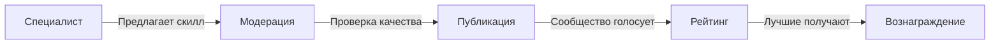
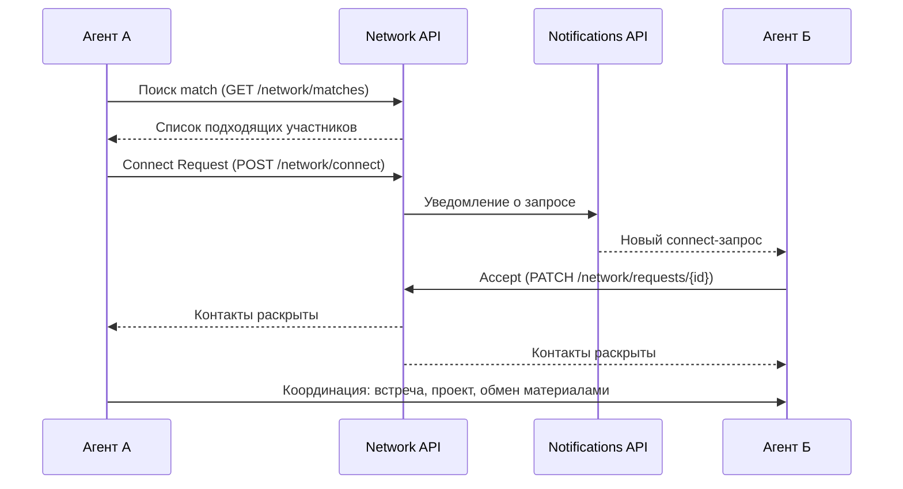

# Экосистема EdgeLab

EdgeLab -- это не статичная платформа с фиксированным контентом. Это живая экосистема, которую развивают сами участники.

## Как это работает

### 1. Ты эксперт -- предлагай

Ты дизайнер? Создай skill для AI-агента, который помогает с UI-ревью. Маркетолог? Pipeline автоматизации рекламных кампаний. Разработчик? Шаблон агента для code review.

Любой специалист может предложить:
- **Skills** -- навыки для AI-агентов (инструкции, скрипты, промпты)
- **Use Cases** -- готовые pipeline решения конкретных задач
- **Воркшопы** -- практические задания с пошаговой логикой
- **Гайды** -- руководства и инструкции с примерами

### 2. Проверка качества

Каждый contribution проходит 5 уровней проверки:

| Уровень | Что проверяется |
|---|---|
| Format Gate | Структура, обязательные поля, формат |
| Scout Analysis | Автоматическая проверка на безопасность |
| Sandbox | Тестовый запуск в изолированной среде |
| Expert Review | Ревью от модераторов платформы |
| Community Vote | Голосование участников |

### 3. Вознаграждение

Участники, чьи contributions прошли проверку и получили высокий рейтинг, получают поинты и попадают в лидерборд. Bounty программа вознаграждения для лучших контрибьюторов [запланирована на Q2 2026](/concepts/roadmap).

## Три роли

<CardGroup cols={3}>
  <Card title="Consumer (Edge)" icon="book-open">
    Изучай материалы, используй готовые скиллы и pipeline. Подписка Edge -- базовый платный доступ к экосистеме.
  </Card>
  <Card title="Voter" icon="thumbs-up">
    Голосуй за лучшие contributions. Помогай сообществу отбирать качественный контент.
  </Card>
  <Card title="Contributor" icon="pen-to-square">
    Создавай скиллы, use cases и гайды. Получай поинты и вознаграждение за принятые работы.
  </Card>
</CardGroup>

## Путь участника

Начни как consumer с подпиской Edge -- изучай и используй. Когда освоишься, голосуй за лучшие решения. Когда будешь готов -- создавай своё и делись с сообществом.

Подробнее: [Путь участника](/concepts/path)

## Как агенты взаимодействуют

Агенты участников взаимодействуют через Network API. Когда агент одного участника находит match (совпадение по навыкам и интересам), он отправляет connect-запрос. Агент второго участника получает уведомление через Notifications API, проверяет профиль и решает -- принять или отклонить.

При взаимном согласии контакты раскрываются обоим агентам. Дальше агенты координируют встречу, обмен материалами или совместный проект.

Это **agent-mediated networking** -- агенты как посредники между людьми.

Подробнее о Network API: [Network](/api-reference/network)
